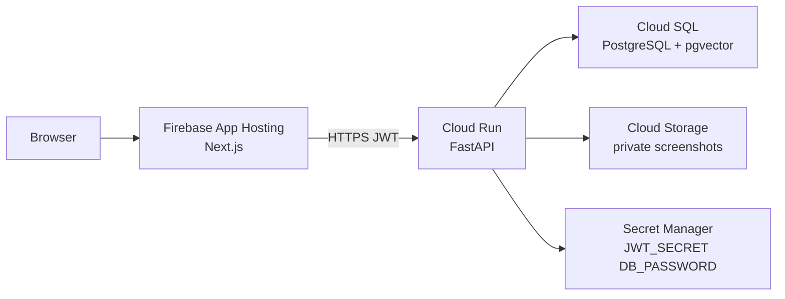

# RecallVault production architecture

This is the **only** hosted stack. Android Share Target is phase 2. The web app ships first with paste-link capture.

**Live GCP project:** `dulcet-doodad-506019-v3`  
**Billing:** `0114E5-F42783-23365F` (sreeram, open)  
**Operator account:** `sr2025official@gmail.com` (Owner)  
**Region:** `us-central1`

| Role | Product | Repo path |
| --- | --- | --- |
| Frontend | **Firebase App Hosting** | `apphosting.yaml`, `firebase.json`, `src/` |
| Backend | **Cloud Run** | `backend/`, `backend/Dockerfile`, `cloudbuild.yaml` |
| Database | **Cloud SQL PostgreSQL + pgvector** | `backend/sql/001_init.sql` |
| Storage | **Cloud Storage** | bucket `$PROJECT_ID-recallvault-screenshots` |
| Secrets | **Secret Manager** | `JWT_SECRET`, `DB_PASSWORD` |

## Rules

- Secrets never live in source. Placeholders only in `.env.example`.
- Cloud SQL has **no public IP**. Cloud Run reaches it with the Cloud SQL connector + VPC connector, `DB_IP_TYPE=private`.
- Cloud Run **min instances = 0**. Firebase App Hosting **min instances = 0**.
- Cloud Storage bucket: uniform access + public access prevention. Screenshots use short-lived signed PUT URLs. Original Instagram media is never stored.
- Frontend paste-link works **without** the API (IndexedDB). Optional cloud library uses `NEXT_PUBLIC_API_URL` → Cloud Run.

## Traffic

1. User opens the Firebase App Hosting URL.
2. Paste a public Instagram/web URL → saved in the browser immediately.
3. Optional: sign in to FastAPI → `POST /v1/items` writes Cloud SQL.
4. Optional screenshot: `POST /v1/screenshots/signed-url` → client PUTs to Cloud Storage. Backend never fetches Instagram.

## Secrets loaded by Cloud Run

| Secret | Used for |
| --- | --- |
| `JWT_SECRET` | Session tokens |
| `DB_PASSWORD` | Cloud SQL user `recallvault` |

Non-secret env: `INSTANCE_CONNECTION_NAME`, `GCS_SCREENSHOTS_BUCKET`, `CORS_ALLOW_ORIGINS`, `DB_USER`, `DB_NAME`, `DB_IP_TYPE=private`.
