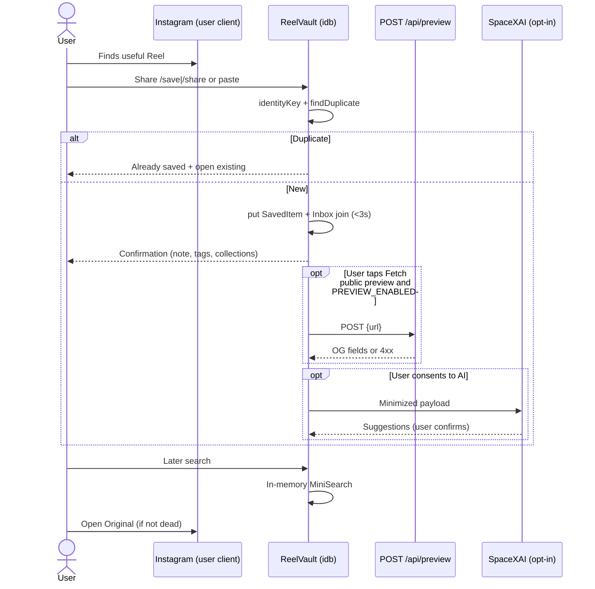
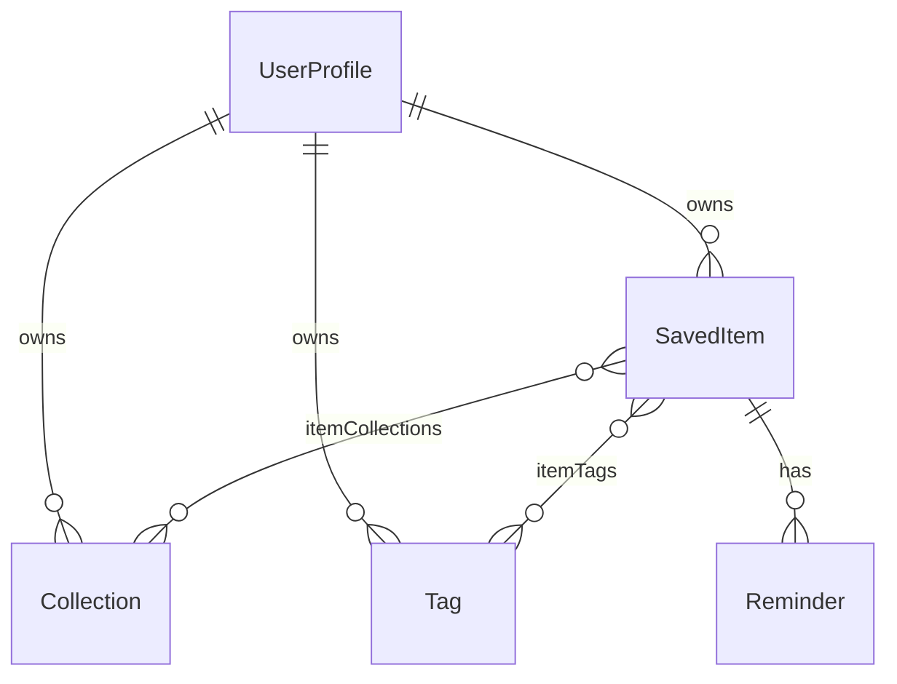
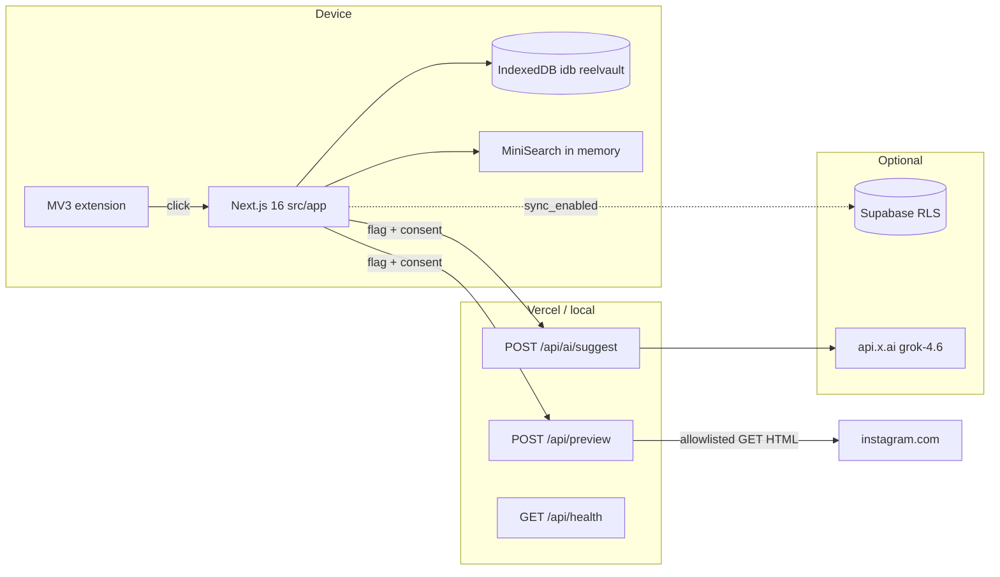
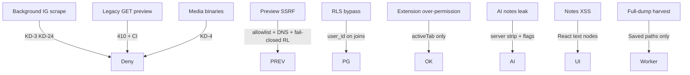

# ReelVault — Product + Technical Design

| Field | Value |
|---|---|
| **Document** | ReelVault Product + Technical Design (implementation contract) |
| **Author** | Engineering / Product (placeholder) |
| **Date** | 2026-08-19 |
| **Revised** | 2026-08-19 (starter-aligned revision) |
| **Status** | Draft |
| **Baseline** | Existing starter at `/Users/sreeramreddysr/reelvault` — **not greenfield** |
| **Stack (adopted)** | Next.js **16.3.1** App Router under `src/app`, React 19, TypeScript, Tailwind CSS **4**, **npm**, IndexedDB via **`idb`** (`src/lib/db.ts`), custom UI (no shadcn), Geist + Newsreader, `--paper` / `--accent` tokens |
| **Audience** | Senior product + engineering evolving the starter |

This document is the implementation contract **against the starter**. If a behavior is not specified here, prefer **Key Decisions** and the **Compatibility matrix**, then the privacy constraints, then the smallest local-first change to existing files. **Do not re-scaffold the app.**

---

## Existing starter (what is already shipped)

The tree at `/Users/sreeramreddysr/reelvault` already implements a working local-first MVP spine. Treat it as the system of record for paths, names, and UI unless a row in the compatibility matrix says **change**.

**Already in tree (do not re-land as greenfield work):**

| Area | Location |
|---|---|
| App shell, nav, Inbox / Search / Collections / Rediscover / Settings | `src/app/*/page.tsx`, `src/components/layout/app-shell.tsx` |
| Landing + local session | `src/app/page.tsx`, `createLocalUser` in `src/lib/db.ts` |
| Paste capture + `/save` + `/share` | `src/components/capture/save-form.tsx`, `src/app/save/page.tsx`, `src/app/share/page.tsx` |
| Item detail | `src/app/item/[id]/page.tsx` |
| MiniSearch + NL parser | `src/lib/search.ts`, `src/lib/nl-query.ts` |
| Export CSV/JSON/Markdown | `src/lib/export.ts` |
| Instagram-export ingest (non-compliant walker — replace) | `src/lib/instagram-export.ts` |
| Preview POST + GET 410 | `src/app/api/preview/route.ts` |
| AI suggest (`grok-4.6`) | `src/app/api/ai/suggest/route.ts` |
| MV3 extension (`activeTab` only) | `extension/` |
| PWA share target → `/share` | `public/manifest.webmanifest` |
| `idb` schema `reelvault` v2 + `identityKey` index | `src/lib/db.ts` |
| URL helpers including `l.instagram.com` unwrap | `src/lib/urls.ts` |
| Vitest | `src/lib/*.test.ts`, `npm test` |
| Supabase RLS draft | `supabase/migrations/0001_init.sql` |
| Product docs (paraphrases — §8.2 wins) | `docs/` |

**Weeks 1–5 / old PRs 1–11 in the previous draft are already in tree. Do not rebuild them.** Remaining work is alignment, hardening, and optional cloud.

---

## Key Decisions

Binding unless a later revision replaces them.

| ID | Decision | Rationale |
|---|---|---|
| KD-1 | **Local-first IndexedDB (`idb`, database `reelvault`) is the system of record on-device.** Keep `src/lib/db.ts`. Do not rewrite onto Dexie. | Starter already ships a working repository. A Dexie port is risk with no product gain. |
| KD-2 | **Optional Supabase sync is never required.** `sync_enabled` defaults **false**. Encrypted-at-rest, RLS-isolated. Signing out does not delete the local library unless the user confirms. | Cloud is backup/multi-device, not a gate. |
| KD-3 | **Never collect Instagram credentials. Never call unofficial Instagram APIs. Never scrape in the background. Never claim auto-import of Instagram Saved.** | Meta ToS + trust. |
| KD-4 | **Instagram media is never downloaded or stored by default.** URL + user metadata only. Optional user-pasted caption/transcript. Optional OG text + thumbnail *URL* after explicit preview. | Avoids redistribution and ToS risk. |
| KD-5 | **Preview is `POST /api/preview` only.** `GET /api/preview` stays **410**. Instagram-host allowlist, SSRF-safe, no cookies, no binaries. **Web bookmarks (`web_link`) do not get OG fetch.** **Dogfood-only:** `PREVIEW_ENABLED` is **off** on shared/public hosts. Localhost may fetch Instagram HTML as today. Do **not** fetch Instagram HTML from a public deployment until a domain and legal entity exist. Do **not** disable preview on localhost. | Retires the open-proxy GET. User decision 2026-08-19: keep dogfood-only; no public IG HTML fetch yet. Starter path is kept (do not invent `/api/metadata/preview`). |
| KD-6 | **Do not use Instagram oEmbed / Graph API as a catalog source.** | oEmbed license is embed-only. |
| KD-7 | **AI uses SpaceXAI only after consent, minimized payload, default model `grok-4.6`.** Server strips `userNote` unless `includeNote === true`. Server strips caption/transcript unless `includeCaption === true` (default false). Server-side 2k `slice`. Rate-limited. Flag `AI_ENABLED` default **off**. | Starter already defaults `grok-4.6`; harden enforcement. |
| KD-8 | **`identityKey = ig:shortcode:{code}` is the duplicate identity.** `/reel/{code}` ≡ `/p/{code}` ≡ `/reels/{code}`. Unwrap `l.instagram.com/?u=`. Unique per library. **Remove `allowDuplicate`.** | Starter already computes the key (`src/lib/urls.ts`) but does not uniquely enforce or merge historical rows. Starter **must change**. |
| KD-9 | **Never silently move or delete.** AI suggests only. | High-trust knowledge tool. |
| KD-10 | **No autoplay, no infinite scroll, no discovery of others’ content.** Pagination + **Load more**. | Anti-graveyard, not a Reels clone. |
| KD-11 | **Private library isolation.** Device-local session or signed-in owner only. | No public item pages. |
| KD-12 | **Search is lexical first.** MiniSearch rebuilt **on library mutation**, held in memory; do not rebuild per keystroke. Postgres `tsvector` later. No `vector` column in `0001`. | Starter rebuilds MiniSearch inside `searchItems` today — that misses the 2k-item budget. |
| KD-13 | **Dead links keep user data.** Disable **Open Original** when `unavailable` or `reported_dead`. | Starter cards already disable `reported_dead`; extend to check-result `unavailable`. |
| KD-14 | **PWA Share Target is Android-first. Keep action `/share`.** iOS: paste. | Do not break `public/manifest.webmanifest` or the extension. |
| KD-15 | **Analytics opt-in, default off.** **No `/api/analytics` until a dedicated later PR.** Starter toggle stays local-only. | KD-15 and the starter agree: do not send events. |
| KD-16 | **Last-write-wins sync with tombstones** after the first local→cloud link. First link uses identity-key merge (E9). | Simple personal-library sync. |
| KD-17 | **Global `Referrer-Policy: no-referrer` (starter `next.config.ts`) plus `referrerPolicy="no-referrer"` on `` and a letter-well placeholder.** Do not proxy/cache Instagram CDN bytes. | Global header is stronger; attribute + placeholder still required. |
| KD-18 | **Export is user metadata, not Instagram media.** Adopt starter CSV/JSON columns; add `version: 1`; omit `thumbnailUrl` unless the user checks **Include preview URLs**. | Ownership without redistribution. |
| KD-19 | **Adopt starter routes, stack, and tokens.** Next 16, `src/app`, npm, `idb`, Geist/Newsreader, `--paper`/`--accent`. Keep `/save`, `/share`, `/item/[id]`. Do not add shadcn. A visual reskin is **not** on the critical path. | Re-scaffolding would clobber a working tree. |
| KD-20 | **Inbox / Watch Later / Needs Review are system collections (`systemKey`). Drop any `inInbox` flag.** `needsReview` is a denormalized query flag maintained by the repository. **Leave Inbox** = delete the Inbox join; do not delete the item. | One source of truth (starter). |
| KD-21 | **IDs become UUID before any cloud path.** Keep `idb`. Add `updatedAt`, `deletedAt`, `revision`, `deviceId` in IndexedDB **v3**. New writes use `crypto.randomUUID()`. | nanoid cannot be a Postgres `uuid` PK. Hard deletes cannot LWW. |
| KD-22 | **Adopt favorites, `openCount`, and an opt-in fake sample library.** Do **not** seed topic collections (Coding, Recipes, …) unless the user opts into the sample. Rediscover uses a weekly shuffle, not engagement scoring. | README demo queries depend on favorites/`openCount`; sample must not look like Saved-tab import. |
| KD-23 | **§8.2 verbatim consent is the only in-app copy source.** Point `docs/consent-copy.md` at this document. Do not treat starter paraphrases as approved. | Three sources of truth is a bug. |
| KD-24 | **MVP link-check is user-tapped “Check original” only.** No weekly/background batch. | KD-3 forbids automated IG access. |
| KD-25 | **Share-target and extension landings auto-save once, then confirm.** Keep `/save` and `/share` working. Paste composer saves on explicit Save or on blur of a valid URL — **not** on each keystroke. | Capture SLA <3s; starter currently prefills and waits for submit. |

### Compatibility matrix (adopt vs change starter)

| Topic | Starter today | Decision | Action |
|---|---|---|---|
| Next 16.3.1, `src/app`, npm, Tailwind 4 | Shipped | **Adopt** | Do not rescaffold |
| Dexie vs `idb` | `idb` in `src/lib/db.ts` | **Adopt `idb`** | No Dexie rewrite |
| shadcn / Inter / Source Serif / `--rv-*` | Custom UI, Geist/Newsreader, `--paper`/`--accent` | **Adopt starter** | Visual PR only if product later wants it |
| Routes `/save` `/share` `/item/[id]` | Shipped; extension → `/save`; manifest → `/share` | **Adopt** | Optional `/capture` 308 later; not required |
| Preview path | `POST /api/preview`; `GET` → 410 | **Adopt path; harden; dogfood-only** | Rate limit, CI forbids a live GET fetcher. `PREVIEW_ENABLED` off on shared hosts. Localhost preview stays on. No public IG HTML fetch until a domain/entity exist. |
| Shortcode identity | `identityKey()` exists; index non-unique; `/reel` vs `/p` still different `canonicalUrl` | **Change (KD-8)** | Unique per library; merge v1 duplicates; remove `allowDuplicate` |
| `l.instagram.com` unwrap | Already in `safeUrl` | **Adopt** | Add regression tests; keep |
| Inbox / Needs Review | System collections + `needsReview` flag | **Adopt collections; drop `inInbox`** | Leave Inbox = remove join |
| IDs | `nanoid()` | **Change** | UUID in IDB v3 before sync |
| Tombstones | Hard `delete()` | **Change** | `deletedAt` + filter |
| Availability | `saved \| processing \| unavailable \| reported_dead` | **Adopt + extend** | Keep both `reported_dead` (user) and `unavailable` (check). Add `restricted`, `expired_story` as optional check results. Do not invent `unknown` as a separate product state — new saves stay `saved` until a check. |
| Favorites / `openCount` | Shipped | **Adopt** | Keep sorts + NL `favorite` / `never opened` |
| Sample library | Opt-in checkbox; fake `/reel/PYCHATBOT01/` URLs | **Adopt opt-in** | Default **off**. Topic collections only with sample. |
| Topic seed collections | Always created in `DEFAULT_COLLECTIONS` | **Change** | `createLocalUser` seeds **only** Inbox, Watch Later, Needs Review |
| Preview GET open proxy | Already 410 | **Keep 410** | CI test |
| Import walker | Saved-key filter then recursive walk of those nodes | **Change** | Saved JSON files only; ZIP worker; reject DMs-only / `.html/.txt/.js`; no full-dump harvest |
| AI model | `grok-4.6` | **Adopt + harden** | `includeCaption` default false; IP RL; flag off |
| `sync_enabled` / `vector` | No prefs table; vector commented 1536 | **Change SQL** | `sync_enabled default false`; no vector in `0001` |
| Rediscover scoring | `openCount` / note / age score | **Change** | Weekly shuffle `deviceId + ISO week` |
| PAGE_SIZE | 12 | **Change** | 50 + Load more |
| MiniSearch lifecycle | Rebuild every `searchItems` call | **Change** | Rebuild on mutation |
| Keyboard | Cmd/Ctrl+K | **Adopt for MVP** | `j/k` only in a11y PR |
| Open Original on dead | Disabled for `reported_dead` | **Change remaining** | Also disable `unavailable`; update `docs/test-plan.md` |
| Consent copy | Landing checkbox exists; Settings paraphrased; `docs/consent-copy.md` differs | **Change** | §8.2 verbatim everywhere |
| Delete confirm | `prompt('Type DELETE…')` | **Adopt typed DELETE** | Replace `prompt` with in-app field |
| `allowDuplicate` | Still on `SaveDraft` (UI copy no longer offers it) | **Change** | Delete the flag and second-row path |
| Carousel `sourceType` | `img_index` on the **raw** URL before canonicalize strips it | **Adopt** | Do not invent other carousel detectors in MVP |
| Export schema | camelCase, `"; "` lists, no `version` | **Adopt columns; add `version: 1`** | Snake_case CSV rejected |
| Analytics HTTP | None | **Adopt none** | No route until a later PR |
| Service worker | None | **Change (later PR)** | Minimal SW, not “Serwist or next-pwa” hand-wave |
| Extension origin | Hardcoded `http://localhost:3000` | **Change** | `extension/build.mjs` or documented edit of `background.js` |

---

## 1. Concise PRD

### 1.1 Problem

Instagram’s Save button creates a digital graveyard. People save Reels and posts with high intent — recipes, coding tips, travel places, workouts, business ideas, study resources — then cannot retrieve the exact item later.

Flaws to close:

1. No meaningful search across saved content (keywords, notes, topic, creator, caption, date, spoken words).
2. One mixed, unstructured feed across unrelated niches.
3. Manual folder maintenance is high friction.
4. No useful filters or sorts (oldest, newest, creator, topic, type, last opened, most opened, favorites).
5. Originals disappear when creators delete, archive, or restrict them.
6. Users do not own an exportable library of their metadata.
7. Desktop browsing loses context (scroll reset, no recently viewed).

### 1.2 Value proposition

**Save a Reel once. Find it later in seconds.**

ReelVault is a personal knowledge library for content the user *chose* to keep. It is not a social network, not an Instagram client, and not a media host.

### 1.3 Goals

- Capture a public Instagram URL in under 3 seconds from paste, Android share sheet (`/share`), or extension Save (`/save`).
- Retrieve a previously saved item in under 10 seconds via search, filters, or collections.
- Let users attach notes, tags, favorites, and multi-collection membership without mandatory folder chores.
- Preserve user metadata when the original becomes unavailable.
- Offer complete export and typed-DELETE erasure.
- Work fully offline for the personal library once the app shell is cached (SW PR).
- Stay inside Meta’s user-initiated-URL, no-scrape, no-media-redistribution envelope.

### 1.4 Non-goals

| Non-goal | Why |
|---|---|
| Import the user’s existing Instagram Saved tab automatically | Unofficial APIs / scrape |
| Instagram login or password collection | Hard fail |
| Background crawling, weekly link-check batches, Stories scrape, DM ingest | ToS + KD-24 |
| Downloading or redistributing Instagram media | Copyright + ToS |
| Multi-user sharing, public collections | Not a social product |
| In-app Reel player / oEmbed catalog | KD-6 |
| iOS native share-target parity | Platform gap |
| React Native | PWA first |
| Re-scaffold onto Next 15 / Dexie / shadcn / pnpm | Would destroy the starter |
| Semantic/vector search in `0001` | Later additive migration |
| `/api/analytics` in MVP | KD-15 |
| Web-bookmark OG unfurl | Allowlist is Instagram-only |

### 1.5 Success metrics

| Metric | Target | How measured |
|---|---|---|
| Time-to-save | p50 < 3s from share/extension landing (or paste Save/blur) to IndexedDB write + visible “Saved” | Client timer; preview/AI **not** on the critical path |
| Time-to-retrieve | p50 < 10s from search focus to opening the intended item | Client timer |
| Organization rate | ≥50% of items have a note, tag, favorite, or non-system collection within 7 days | Local counts |
| Reopen of older saves | Increase 7d+ reopen rate after Rediscover shuffle ships | `lastOpenedAt - savedAt >= 7d` |
| Safety | 0 Instagram passwords; 0 background scrapes; 0 media binaries by default | CI grep + tests |

### 1.6 MVP vs later (relative to the starter)

**Already shipped (weeks 1–5 equivalent):** local library, paste + `/save` + `/share` (prefill-only today), notes/tags/collections, lexical search, export, extension, preview POST, AI route, Rediscover UI.

**Delta MVP (this revision’s plan):** unique shortcode identity, auto-save capture SLA, Saved-only ZIP import, consent verbatim, UUID+tombstones, preview/AI abuse controls, search index lifecycle, weekly shuffle, user-tapped availability check, optional sync (flag off).

**Later:** React Native, iOS share extension, E2E note encryption, vector search, weekly batch link-check, public analytics endpoint, visual reskin.

---

## 2. User personas and jobs-to-be-done

### 2.1 Persona A — “Ananya the CS student”

- 21, Android + laptop, saves 15–40 Reels/week: coding patterns, internship tips, ML explainers.
- Pain: “I know I saved a Python chatbot reel around January.”
- JTBD: When starting an assignment, find the exact tutorial in under a minute.
- Success: Search `python chatbot january` returns it with her note “use for ML project.” (Sample library item `PYCHATBOT01` is the demo stand-in.)

### 2.2 Persona B — “Marcus the creator”

- 29, edits vertical video; saves hooks, thumbnails, audio ideas.
- JTBD: Scripting tonight’s video from a Watch Later queue and a favorite hooks list.
- Success: Favorite + Watch Later + `from editsbykira` filter; reopen original on Instagram.

### 2.3 Persona C — “Priya the professional”

- 36, saves recipes, Hyderabad cafes, workouts.
- JTBD: Plan a weekend with “Hyderabad cafes with outdoor seating” even if the original dies.
- Success: Note + tags survive `unavailable` / `reported_dead`; export JSON.

### 2.4 Secondary jobs

| Job | Trigger | Desired outcome |
|---|---|---|
| Capture in the moment | Seeing a useful Reel | Share/extension auto-saves; optional one-line note |
| File later | Inbox grown | Bulk tag, merge collections, Needs Review |
| Trust the vault | Privacy anxiety | Local-only, export, typed DELETE |
| Recover | Dead original | Notes remain; Open Original disabled |

---

## 3. User flows and edge cases

### 3.1 Happy path



### 3.2 Capture sources (starter contracts)

| Source | Starter route | Required behavior |
|---|---|---|
| Paste | Inbox `SaveForm` compact + `/save` | Explicit **Save** or **blur** of a valid URL (once) |
| Android PWA | GET `/share?title&text&url` | Extract URL → **`saveUrl` once on mount** → confirmation |
| Chrome/Edge MV3 | Opens `/save?url=` | Same auto-save-once |
| Data-export | Settings file input | Saved JSON / ZIP only (replace walker) |

No other sources. Do not add `/capture` as the primary path. If a later alias is useful, `308 /capture → /save` — not a week-1 task.

**Debounce rule:** Auto-save runs **once per `identityKey` per page lifetime** (`useRef`). Invalid or empty URL does not write. Changing the URL field after auto-save does **not** create a second row; it updates the draft or shows duplicate.

### 3.3 URL parsing and identity (normative; implement in `src/lib/urls.ts`)

Hosts: `instagram.com`, `www.instagram.com`, `m.instagram.com`, `l.instagram.com`.

Unwrap `https://l.instagram.com/?u=<urlencoded>` (already in `unwrapInstagramRedirect`).

Strip query/hash tracking: `igsh`, `igshid`, `utm_*`, `fbclid`, `ig_rid`, `img_index` (keep original `img_index` in `metadataJson.originalQuery` only).

**Identity:**

| Pattern | `sourceType` (starter enum) | `identityKey` |
|---|---|---|
| `/reel/{code}`, `/reels/{code}`, `/{user}/reel/{code}` | `instagram_reel` | `ig:shortcode:{code}` |
| `/p/{code}`, `/{user}/p/{code}` | `instagram_post` | `ig:shortcode:{code}` |
| `/p/{code}` + raw `img_index` | `instagram_carousel` | `ig:shortcode:{code}` (same item) |
| `/tv/{code}` | `instagram_other` | `ig:shortcode:{code}` |
| `/stories/{user}/{id}` | `instagram_story` | `ig:story:{user}:{id}` |
| `/{username}/` | `instagram_profile` | `ig:profile:{username}` |
| Other IG | `instagram_other` | `ig:url:{canonical}` |
| Non-IG | `web_link` | `web:{canonical}` |

**Shortcode charset:** `[A-Za-z0-9_-]+`, length **5–32** (looser than 5–15 so newer IG codes do not silently fail).

`canonicalUrl` may still show `/reel/` vs `/p/` as first-seen path (starter `canonicalizeUrl` does **not** rewrite `/p` → `/reel`). **Dedupe must not use canonical equality alone.**

### 3.4 `saveUrl` control flow (replaces `allowDuplicate`)

Implement in `saveItem` / `saveItemRecord` (`src/lib/library-context.tsx`, `src/lib/db.ts`):

```
saveUrl(raw, opts):
  parsed = canonicalize + identityKey
  if !parsed: throw InvalidUrlError
  existing = findDuplicate(raw)  // identityKey index, then canonical, then scan
  if existing && !existing.deletedAt:
        if opts.note and not existing.userNote:
          existing.userNote = opts.note
          existing.updatedAt = now
          existing.revision += 1
        bump updatedAt
        return { duplicate: true, item: existing }
  try:
    item = put new SavedItem {
      id: crypto.randomUUID(),
      identityKey,
      updatedAt: now,
      deletedAt: null,
      revision: 1,
      deviceId: settings.deviceId,
      availabilityStatus: "saved",
      ...
    }
    add Inbox join
    optional Watch Later / user collections / tags
    sync needsReview flag + Needs Review join
    rebuildSearchIndex()
  catch QuotaExceededError:
    show E10; do not throw an uncaught crash
  return { duplicate: false, item }
```

**Do not** use a unique IDB index as the only control flow (a unique secondary index on a new `id` would throw `ConstraintError` and is easy to mishandle). Check-then-put is the algorithm. After v3 merge, a **unique** `identityKey` index is allowed as a safety net; on `ConstraintError`, load existing and return `{ duplicate: true }`.

Remove `allowDuplicate` from `SaveDraft`, `onSubmit`, and `docs/test-plan.md` (“Save another copy anyway”).

### 3.5 Edge cases

#### E1 — Duplicate

- UI: **Already in your library.** **Saved {relative_date}. Add a note or open it.** Primary **View existing** → `/item/{id}`. No second row.
- Rapid double-submit: same `identityKey` returns the first row.

#### E2 — Private / unavailable metadata at capture

- Preview 4xx/502. Save **still succeeds**. Placeholder thumbnail.
- Copy: **Preview isn’t available. The original may be private, deleted, or restricted. Your link and notes are saved.**
- Status stays `saved` until a user-tapped check.

#### E3 — Dead original later (user-tapped only)

- Item overflow **Check original** calls `POST /api/preview` (same allowlist).
- HTTP 404/410 or explicit unavailable heuristic → `availabilityStatus = unavailable`.
- User assertion **Mark unavailable** → `reported_dead` (starter `markUnavailable`).
- Both disable Open Original. Banner: **This post is no longer available on Instagram. Your notes are still here.**
- **No weekly Rediscover batch. No background GET to Instagram.**

#### E4 — Offline capture

- `idb` write works if the document is loaded. Without a SW, a cold start offline cannot load the app.
- Until the SW PR: banner **You’re offline. If this page is already open, saves stay on this device.**
- After SW PR: app shell + IDB; queue preview/AI as `pendingOps`.

#### E5 — Instagram data-export import (replace starter walker)

**Reject** `extractUrlsFromExportPayload` as a full-dump harvester. Even with today’s `SAVED_KEYS` filter, a mixed export that nests saved-like keys, or a future walker regression, can ingest DMs. Normative rules:

1. Accept **`.json` or `.zip` only**. `.html`, `.txt`, `.js` are out of MVP (change Settings `accept`).
2. ZIP parsed **on-device** (JSZip in a Web Worker). **Never upload the ZIP.**
3. Open only these paths (first existing wins; scan the list, do not scan the rest of the archive):
   - `saved/saved_posts.json`
   - `saved/saved_reels.json`
   - `saved/saved_collections.json`
   - `your_instagram_activity/saved/saved_posts.json`
   - `your_instagram_activity/saved/saved_reels.json`
   - `your_instagram_activity/saved/saved_collections.json`
4. If none exist: **This file doesn’t include Saved content. When you request your Instagram export, select Saved (and JSON).**
5. If the ZIP is messages/contacts/media only: hard-fail, **zero** items, no DM text stored.
6. Never regex-harvest URLs from `messages/`, `followers/`, `personal_information/`, `media/`.
7. Defensive JSON: `href` | `link` | `url`; unix or ISO timestamps.
8. Cap 10,000 items / 200 MB. 10,001st → stop, `needsReview` on the job.
9. Dedupe via `identityKey`. Report `imported`, `duplicatesSkipped`, `unparseable`.
10. Collection names from `saved_collections` are **suggestions**; default off. Checkbox **Keep Instagram collection names**.
11. Single JSON file: parse only if top-level keys match Saved (`saved_saved_media`, `saved_saved_collections`, etc.). If the file is a full dump object, **only** read those keys — do not walk `messages`.

#### E6 — Consent denied

| Consent | Denied behavior |
|---|---|
| Preview | No `POST /api/preview` |
| AI | No `POST /api/ai/suggest` (on-device `localSuggest` only) |
| Include my notes | Server strips `userNote` even if the client sends it |
| Include caption/transcript | Server strips those fields |
| Cloud sync | IDB only |
| Analytics | No network |
| Check original | No outbound fetch |

#### E7 — Invalid URL

- Non-URL: **Paste an Instagram link (instagram.com/reel/… or /p/…).**
- Non-IG: confirm **This isn’t an Instagram link. Save it as a web bookmark?** (`web_link`). No preview.
- Stories: save allowed; **Stories often expire in 24 hours. We’ll keep your notes if the link dies.**

#### E8 — Extension on a non-Instagram tab

- Default: still offer save as `web_link` (starter behavior). Settings `extensionRestrictToInstagram` default **false** to match today; if later true, show **Open an Instagram post, then click Save.**

#### E9 — First local→cloud link only

When a local library is first associated with a Supabase user:

- Prompt: **Upload this device library to your account?** **Merge** (default) / **Keep local only** / **Replace cloud** (type REPLACE).
- Merge on `identityKey`. Conflicting notes: keep the longer; if both nonempty and unequal, concatenate with `\n--- merged ---\n` and set `needsReview`.
- **After this first link, KD-16 LWW applies to every field including notes.** Do not re-run E9 on every sync.

#### E10 — Quota

Catch `QuotaExceededError` on every `put`. Modal: **This device is out of space for ReelVault. Export a backup, delete archived items, or enable cloud sync and remove local copies of archived items.** Never auto-purge.

---

## 4. Information architecture

### 4.1 Navigation (starter)

| Item | Route | Purpose |
|---|---|---|
| Inbox | `/inbox` | Default home. System collection `inbox`. |
| Search | `/search` | Full search + filters. |
| Collections | `/collections`, `/collections/[id]` | User + system collections. |
| Rediscover | `/rediscover` | Shuffle digest, Watch Later, reminders, dead links. |
| Settings | `/settings` | Consent, import/export, delete. |
| Save | `/save` | Extension + paste landing. |
| Share | `/share` | PWA share target. |
| Item | `/item/[id]` | Detail. |
| Privacy | `/privacy` | Policy outline. |
| Landing | `/` | Local session create. |

Persistent search in `AppShell` (starter Cmd/Ctrl+K). Do not rename routes.

### 4.2 Object model



**System collections (not user-deletable):** Inbox (`systemKey=inbox`), Watch Later (`watch_later`), Needs Review (`needs_review`).

**Leave Inbox:** `removeItemFromCollection(itemId, inbox.id)`. Item remains in any other collections; if none, it still exists and is searchable.

**Needs Review:** repository sets `needsReview=true` and adds the join when there is no note, no user tags, and no non-system collections. Clearing those fields removes the join and sets the flag false. Do not keep a second independent boolean that can drift — the flag is written in the same transaction as the join.

**Archive** is `isArchived` (not a collection). **Favorite** is `isFavorite`. **Pin** is `isPinned`.

### 4.3 Empty / error / permission states

| State | Copy (verbatim) | Actions |
|---|---|---|
| Empty Inbox | **Nothing saved yet.** **Share a Reel to ReelVault, paste a link, or install the browser extension.** | Paste, How it works |
| Empty search | **No matches in your library.** **Try a creator name, a note you wrote, or a date like “January.”** | Clear filters |
| Empty collection | **This collection is empty.** **Add items from Inbox, or save a new link into it.** | Add items |
| Preview denied | **Preview skipped.** **We’ll save the link and your notes.** | Continue |
| Offline | **You’re offline. Saves stay on this device.** | Dismiss |
| Quota | E10 copy | Export |
| Sync signed-out | **Your library lives on this device. Sign in only if you want an encrypted cloud backup.** | Sign in, Not now |

---

## 5. High-fidelity screen specifications

### 5.1 Design language — **adopt starter tokens**

Do **not** introduce `--rv-*`, Inter, or Source Serif 4 as a blocking change.

| Token | Light (`:root`) | Dark | Use |
|---|---|---|---|
| `--paper` | `#f3eee4` | `#13110f` | App background |
| `--paper-raised` | `#fffaf1` | `#1c1916` | Cards |
| `--ink` | `#1b1814` | `#f3ede2` | Text |
| `--ink-muted` | `#6b645a` | `#a89f91` | Meta |
| `--line` | `#d9cfbd` | `#2c2823` | Borders |
| `--accent` | `#1f5c4d` | `#86c2b0` | Buttons |
| `--gold` | `#b0893a` | `#d4b06a` | Highlights |
| `--danger` | `#8f3d32` | `#e08a7a` | Delete / dead |

Type: Geist Sans UI, Newsreader display (`.display`), Geist Mono URLs. Radius 18–28px as in existing cards. Manifest colors already `#f3eee4` / `#1f5c4d`.

Spacing: keep existing component padding. Min tap 44×44 in the a11y PR.

Breakpoints: existing Tailwind defaults. Content width as in current pages.

### 5.2 Shared chrome

Keep `AppShell`, `ItemCard`, `ItemRow`, `PaginatedGrid`. Cards: letter-well placeholder if no `thumbnailUrl`; if present, ``. Favorite star + pin remain.

**Open Original:** render a disabled control when `availabilityStatus` is `unavailable` or `reported_dead`. Never `window.open` in that state.

### 5.3 Landing `/` (onboarding)

Keep the two-column starter layout. Required checkbox (§8.2). Sample library checkbox default **off**, labeled as fake. CTA **Create my vault** disabled until the password checkbox is true (already).

### 5.4 Inbox `/inbox`

Keep current toolbar + compact `SaveForm`. After capture PR: compact composer saves on Save click or blur-once. Filters: Inbox membership (system join), Needs Review, All, Archived. Sorts: starter list including **most opened**. Pagination: **50** then Load more (change `PAGE_SIZE` in `paginated-grid.tsx`). No infinite scroll (already).

Keyboard MVP: keep Cmd/Ctrl+K. `j/k`/`o`/`/` deferred to a11y PR.

### 5.5 Capture confirmation (`/save`, `/share`)

After auto-save: show the existing `SaveForm` as a **confirmation editor** bound to the saved id (note, tags, collections, Watch Later, preview/AI toggles). Status chip: Saved | Already saved | Preview unavailable | Offline.

Preview and AI remain explicit buttons (starter). They never block the initial write.

### 5.6 Search `/search`

Keep NL examples and filters (including favorites / never opened). Add `<mark>` highlighting in the a11y PR; keep `matchReasons` until then.

### 5.7 Item detail `/item/[id]`

Keep starter detail. Add **Check original** (user-tapped). Disable Open Original when dead.

### 5.8 Collections

Keep merge/rename. Deleting a collection does not delete items.

### 5.9 Rediscover

Replace score sort with:

```
seed = hash(settings.deviceId + isoWeek(now))
candidates = items where !isArchived && savedAt <= now-14d
shuffle(candidates, seed).slice(0, 12)
```

Modules (finite lists, max 12): This week’s recap, Stale (`!lastOpenedAt` or last opened > 90d), Watch Later, Needs attention (`unavailable` | `reported_dead` | `needsReview`).

Reminders: user-set only. Copy: **We’ll remind you in ReelVault. Device notifications are optional and off until you allow them.**

### 5.10 Settings

Replace paraphrase with §8.2 strings. Import accept `.json,.zip`. Delete: in-app `DELETE` field, not `window.prompt`.

### 5.11 A11y (later PR)

Skip link, `prefers-reduced-motion`, 44px targets, focus trap, `aria-live` for Saved / Already / Offline. Strip `url`/`text` from any error reporter (share-target query).

---

## 6. Proposed architecture

### 6.1 System context



Library CRUD stays in the client (`LibraryProvider`). HTTP is preview, AI, health, and later sync.

### 6.2 Client types (delta on `src/lib/types.ts`)

Keep starter `SourceType` and product fields. Add sync fields; do **not** add `inInbox`.

```ts
export type AvailabilityStatus =
  | "saved"
  | "processing"
  | "unavailable"
  | "reported_dead"
  | "restricted"
  | "expired_story";

export interface SavedItem {
  id: string;                 // UUID after v3
  userId: string;
  sourceUrl: string;
  canonicalUrl: string;
  identityKey: string;        // required after v3 backfill
  sourceType: SourceType;
  captureSource?: "paste" | "share_target" | "extension" | "ig_export" | "manual";
  creatorName?: string;
  title?: string;
  thumbnailUrl?: string;
  savedAt: string;
  lastOpenedAt?: string;
  openCount: number;
  availabilityStatus: AvailabilityStatus;
  availabilityCheckedAt?: string;
  userNote?: string;
  captionText?: string;
  transcriptText?: string;
  metadataJson?: Record<string, unknown>;
  isFavorite: boolean;
  isPinned: boolean;
  isArchived: boolean;
  needsReview: boolean;
  updatedAt: string;
  deletedAt?: string;
  revision: number;
  deviceId: string;
}
```

`AppSettings` gains: `deviceId`, `syncEnabled` (default false), `extensionRestrictToInstagram`, `understoodNoPassword` (set true at landing).

### 6.3 IndexedDB v3 migration (`DB_VERSION = 3`)

In `getDb().upgrade`:

1. Ensure `identityKey` index (v2 already). After duplicate merge, recreate as unique if the `idb` version supports it; otherwise keep non-unique + check-then-put.
2. For each item/collection/tag/reminder/importJob/auditLog whose `id` is not UUID, assign `crypto.randomUUID()`, rewrite `itemCollections` / `itemTags` / `reminders.itemId`.
3. Backfill `identityKey` via `identityKey(sourceUrl)`.
4. Group by `identityKey`; keep the oldest `savedAt` as survivor; merge notes (E9 rule); retarget joins; hard-delete loser rows **only during this one-time local merge** (they never synced).
5. Set `updatedAt = savedAt || now`, `revision = 1`, `deletedAt = undefined`, `deviceId = settings.deviceId || new UUID`.
6. Seed `settings.deviceId` if missing.
7. Filter all reads: `!deletedAt`.

`deleteItemRecord` becomes a tombstone (`deletedAt = now`) plus join tombstones (`deletedAt` on join rows). Add `deletedAt?` to join types.

`createLocalUser`: seed **only** the three system collections. Topic collections created inside `installSeed` when the user opted in.

`saveItemRecord`: `crypto.randomUUID()`, required `identityKey`, wrap `put` in quota try/catch.

### 6.4 Preview (`src/app/api/preview/route.ts`)

**Normative:**

- `GET` → **410** `{ error: "GET preview is retired. Use POST /api/preview with a JSON body." }` forever. CI asserts status 410 and that the GET handler does not call `fetch`.
- `POST` JSON `{ url }`.
- Allowlist hosts: `instagram.com`, `www.instagram.com`, `m.instagram.com` (not `l.instagram.com` — unwrap client-side first).
- `https` only. `redirect: "manual"` or `"error"` (starter uses `"error"` — **keep**; do not follow off-allowlist redirects).
- Private IP: after DNS `lookup({ all: true })`, reject if any address is loopback, RFC1918, link-local, ULA, IPv4-mapped private. Implement with explicit prefix checks (starter `isPrivateIp`) — **do not call `net.isPrivate`** (it does not exist). Optionally `net.BlockList` for the same CIDRs.
- Timeout 4s, cap 512 KB **before** full materialize (`res.body` reader or `slice` after checking `content-length`).
- No cookies, no `Authorization`.
- **Dogfood-only (decided):** never fetch Instagram HTML from a public/shared deployment (`NODE_ENV === "production"` or a non-localhost origin) until a domain and legal entity exist — return 503 `PREVIEW_DISABLED`. **Do not disable preview on localhost:** local dogfood may fetch as today with `ReelVaultPreview/0.1 (+http://localhost:3000/privacy)`. `PREVIEW_ENABLED` default **off** on shared hosts; localhost may set it on.
- Rate limit: `lib/rate-limit.ts`. If `UPSTASH_REDIS_REST_URL` + `UPSTASH_REDIS_REST_TOKEN` set, increment key `preview:{ip}` TTL 1h, max 30. Else if development, in-memory `Map`. Else **fail closed** (429/503) — do not ship an unbounded open proxy on Vercel.
- Logs: `sha256(canonicalUrl).slice(0, 12)` only, plus status and ms. Never log raw URLs.
- Server does not write library rows.
- `web_link` → 400 **Preview only fetches public Instagram pages.**

### 6.5 AI (`src/app/api/ai/suggest/route.ts`)

Server **must**:

1. If `AI_ENABLED !== "true"` or no `XAI_API_KEY` → return `localSuggest` (or 503 if you want fail-closed in prod without key — keep today’s local fallback for UX).
2. Rate limit `ai:{ip}` max 50/day (same store as preview).
3. `includeNote !== true` → `userNote = undefined` (ignore client body).
4. `includeCaption !== true` → `captionText = transcriptText = undefined`. **Default false.** Add the flag to `AiSuggestionRequest` and a capture-sheet checkbox **Include pasted caption/transcript**.
5. `slice(0, 2000)` each remaining string **on the server**.
6. `existingCollections.slice(0, 20)`.
7. Model `process.env.XAI_MODEL ?? "grok-4.6"`, base `https://api.x.ai/v1`.
8. Do not log prompt text.

Local-first: no JWT required; IP RL + flag is the abuse control. Do not block AI on PR-auth.

Client: if Settings `allowAiSuggestions` is false, do not call the route (`localSuggest` only). If `allowAiIncludeNotes` is false, send `includeNote: false`.

### 6.6 Search

- `LibraryProvider` holds `mini: MiniSearch | null`.
- Rebuild on `refresh()` after mutations (debounce 50ms).
- `searchItems` uses the cached index; if missing, build once.
- PAGE_SIZE = 50.
- Keep `parseNaturalQuery` (favorite, never opened, dates, creator).

### 6.7 Sync (optional, flag off)

`pendingOps` store (IDB v3):

```ts
type PendingOp =
  | { id: string; type: "upsert_item"; itemId: string; at: string }
  | { id: string; type: "tombstone_item"; itemId: string; at: string }
  | { id: string; type: "upsert_collection" | "tombstone_collection"; collectionId: string; at: string }
  | { id: string; type: "upsert_tag" | "tombstone_tag"; tagId: string; at: string }
  | { id: string; type: "set_join"; kind: "collection" | "tag"; itemId: string; otherId: string; deleted: boolean; at: string }
  | { id: string; type: "upsert_reminder" | "tombstone_reminder"; reminderId: string; at: string };
```

Push batches of 100; pull `updated_since` cursor `{ updatedAt, id }` encoded `iso|uuid`. Conflict: higher `updatedAt`, then `revision`, then `deviceId` lexicographic. Tombstones retained 30 days then `POST /api/gc/tombstones` (authed RPC, deletes where `deleted_at < now() - 30 days` and `user_id = auth.uid()`).

---

## 7. Database schema, mapping, API

### 7.1 Postgres (delta on `supabase/migrations/0001_init.sql` + new `0002`)

**Do not add `embedding` in 0001.** Keep the comment. A later `0003_vector.sql` may `create extension vector` and add a column **after** a model (and dimension) is chosen.

**0002_sync_fields.sql** (additive):

```sql
alter table public.saved_items
  add column if not exists identity_key text,
  add column if not exists capture_source text,
  add column if not exists availability_checked_at timestamptz,
  add column if not exists updated_at timestamptz not null default now(),
  add column if not exists deleted_at timestamptz,
  add column if not exists revision int not null default 1,
  add column if not exists device_id text not null default 'unknown';

create unique index if not exists saved_items_user_identity
  on public.saved_items (user_id, identity_key)
  where deleted_at is null and identity_key is not null;

-- replace unique (user_id, canonical_url) with a non-unique index;
-- identity_key is the duplicate key.

alter table public.saved_item_collections
  add column if not exists user_id uuid references public.profiles (id) on delete cascade,
  add column if not exists deleted_at timestamptz;

alter table public.saved_item_tags
  add column if not exists user_id uuid references public.profiles (id) on delete cascade,
  add column if not exists deleted_at timestamptz;
```

**`user_preferences`:**

```sql
create table if not exists public.user_preferences (
  user_id uuid primary key references public.profiles (id) on delete cascade,
  preview_fetch_default boolean not null default false,
  ai_enabled boolean not null default false,
  ai_include_notes boolean not null default false,
  sync_enabled boolean not null default false,
  analytics_enabled boolean not null default false,
  updated_at timestamptz not null default now()
);
```

**Full RLS (copy-paste into `0002_rls_policies.sql`):**

```sql
alter table public.user_preferences enable row level security;

create policy "own preferences" on public.user_preferences
  for all using (user_id = auth.uid()) with check (user_id = auth.uid());

drop policy if exists "own item collections" on public.saved_item_collections;
create policy "own item collections" on public.saved_item_collections
  for all
  using (user_id = auth.uid())
  with check (
    user_id = auth.uid()
    and exists (select 1 from public.saved_items i where i.id = item_id and i.user_id = auth.uid())
    and exists (select 1 from public.collections c where c.id = collection_id and c.user_id = auth.uid())
  );

drop policy if exists "own item tags" on public.saved_item_tags;
create policy "own item tags" on public.saved_item_tags
  for all
  using (user_id = auth.uid())
  with check (
    user_id = auth.uid()
    and exists (select 1 from public.saved_items i where i.id = item_id and i.user_id = auth.uid())
    and exists (select 1 from public.tags t where t.id = tag_id and t.user_id = auth.uid())
  );
```

Keep existing `own profile` / `own items` / `own collections` / `own tags` / `own reminders` / `own import jobs` / `own audit logs` policies from `0001`.

**Account delete:** client-authenticated `DELETE` via RLS is enough (`delete from saved_items` cascades). **Do not use `SUPABASE_SERVICE_ROLE_KEY` in Next routes for user delete.** If Auth user deletion is required, call `supabase.auth.admin.deleteUser` only from a locked-down server action that first verifies `auth.getUser()`, then deletes the Auth user; prefer documenting “delete library rows + sign out” for MVP.

No Storage bucket for media.

### 7.2 IDB ↔ Postgres mapping

| IDB store | Key | Postgres |
|---|---|---|
| `users` | `id` | `profiles` (cloud id ≠ local id until link) |
| `items` | `id` | `saved_items` |
| `collections` | `id` | `collections` |
| `tags` | `id` | `tags` |
| `itemCollections` | `[itemId+collectionId]` | `saved_item_collections` |
| `itemTags` | `[itemId+tagId]` | `saved_item_tags` |
| `reminders` | `id` | `reminders` |
| `importJobs` | `id` | `import_jobs` |
| `auditLogs` | `id` | `audit_logs` |
| `settings` | `userId` | `user_preferences` |
| `pendingOps` (v3) | `id` | n/a |

camelCase ↔ snake_case in `src/lib/sync/map.ts` (new file, later PR).

### 7.3 HTTP API (starter + later sync)

**Shipped now:**

| Method | Route | Auth | Purpose |
|---|---|---|---|
| GET | `/api/health` | no | `{ ok, instagramLogin: false, scraping: false }` |
| GET | `/api/preview` | no | **410** |
| POST | `/api/preview` | no + RL + flag | IG OG extract |
| POST | `/api/ai/suggest` | no + RL + flag | Suggestions |

**Later sync (do not build until auth PR):**

| Method | Route | Purpose |
|---|---|---|
| GET/POST | `/api/items` | Pull / upsert batch 100 |
| PATCH/DELETE | `/api/items/:id` | Patch / tombstone |
| POST | `/api/items/:id/availability` | User-tapped check (or client calls preview) |
| GET/POST/PATCH/DELETE | `/api/collections`, `/api/tags`, `/api/reminders` | CRUD |
| POST | `/api/collections/merge` | Merge |
| POST | `/api/item-collections`, `/api/item-tags` | Join + tombstone |
| POST | `/api/import-jobs` | Counts only |
| GET | `/api/export` | Cloud metadata dump |
| POST | `/api/account/delete` | RLS deletes + sign out |
| POST | `/api/gc/tombstones` | 30-day purge for caller |

**No `/api/analytics` in this plan’s required PRs.**

#### Error catalog

```ts
type ErrorCode =
  | "INVALID_URL"
  | "HOST_NOT_ALLOWED"
  | "PREVIEW_DISABLED"
  | "METADATA_UNAVAILABLE"
  | "RATE_LIMITED"
  | "AI_DISABLED"
  | "UNAUTHORIZED"
  | "NOT_FOUND"
  | "CONFLICT"
  | "QUOTA";
// { error: { code, message } }
```

`DUPLICATE` is **not** an HTTP error for local save; it is a `saveItem` return value.

#### Zod (implement in `src/lib/api-schemas.ts`)

```ts
export const PreviewRequest = z.object({ url: z.string().min(1).max(2048) });

export const PreviewResponse = z.object({
  title: z.string().optional(),
  description: z.string().optional(),
  creatorName: z.string().nullable().optional(),
  thumbnailUrl: z.string().url().optional(),
  sourceType: z.string(),
});

export const AiSuggestRequest = z.object({
  title: z.string().max(500).optional(),
  creatorName: z.string().max(200).optional(),
  sourceType: z.string(),
  captionText: z.string().max(20000).optional(),
  transcriptText: z.string().max(20000).optional(),
  userNote: z.string().max(20000).optional(),
  includeNote: z.boolean(),
  includeCaption: z.boolean().default(false),
  existingCollections: z.array(z.string().max(80)).max(20).optional(),
});

export const ItemUpsert = z.object({
  id: z.string().uuid(),
  identity_key: z.string(),
  source_url: z.string(),
  canonical_url: z.string(),
  source_type: z.string(),
  updated_at: z.string().datetime(),
  deleted_at: z.string().datetime().nullable().optional(),
  revision: z.number().int(),
  device_id: z.string(),
  // remaining SavedItem fields optional / nullable
}).passthrough();

export const ItemsUpsertRequest = z.object({ items: z.array(ItemUpsert).max(100) });
```

`POST /api/preview` body/response as above. `POST /api/ai/suggest` as above.

`GET /api/items?updated_since=ISO&limit=100&cursor=iso|uuid` → `{ items, nextCursor, hasMore }`.

### 7.4 Export formats (adopt starter columns)

`ExportRecord` stays as in `src/lib/types.ts`. JSON wrapper:

```json
{
  "exportedAt": "2026-08-19T00:00:00.000Z",
  "app": "ReelVault",
  "version": 1,
  "disclaimer": "This file contains your metadata only. Original posts remain on Instagram and are not copied.",
  "items": []
}
```

CSV headers: starter camelCase list. Tags/collections joined with `"; "`. Deleted items omitted. Thumbnails omitted.

---

## 8. Privacy policy outline and in-app consent language

### 8.1 Privacy policy outline

Keep `/privacy` + `docs/privacy-policy-outline.md` aligned with:

1. ReelVault is a personal library for links you choose to save.
2. We are not Instagram. We do not ask for Instagram passwords. We do not import Saved unless you provide a data-export file. We do not scrape in the background.
3. Local-only vs optional account data (same fields).
4. We do not store passwords, cookies, DMs, contacts, media files, or browsing history.
5. Capture methods: share, paste, extension click, user ZIP/JSON.
6. Preview: only if you request it and the flag is on. Public HTML `og:*` only.
7. AI: optional, minimized, notes/captions only with toggles. Prompts not retained.
8. Analytics: off; no endpoint in MVP.
9. No sharing of your library.
10. Retention until delete; tombstones ≤30 days if sync is on.
11. Export and typed DELETE.
12. Originals stay on Instagram and may disappear.
13. Not directed at children under 13 (or 16 where required).
14. Contact: keep placeholder `[privacy@reelvault.example]` while preview stays dogfood-only. Replace only when a domain and legal entity exist.
15. Date-stamped revisions.

### 8.2 In-app consent language (verbatim — only source of truth)

`docs/consent-copy.md` must become a pointer:

> Canonical consent strings live in the design document §8.2. Do not paraphrase in UI.

**Onboarding checkbox** (required)

> I understand ReelVault will not ask for my Instagram password.

**Onboarding sample library** (optional, default off)

> Include a clearly fake sample library so I can try search. These are not my Instagram saves.

**Original-may-disappear** (first three saves + Settings)

> The original post stays on Instagram. If the creator deletes, archives, or restricts it, the link may stop working. ReelVault keeps the URL and any notes you add.

**Preview fetch toggle (Settings)**

> Fetch public preview (title and thumbnail URL only)
> We request public page info. We never log into Instagram. Media is not downloaded.

**Preview button helper**

> Fetch public preview? This reads publicly available page titles and images. It does not log into Instagram. If the site blocks us, you can still save the link.

**AI master toggle**

> Suggest tags with AI (optional)
> Uses SpaceXAI (xAI). We send only the fields you allow. Turn this off anytime.

**AI include notes**

> Include my notes in AI suggestions
> Your notes can contain private context. They are sent only when this is on.

**AI include caption/transcript**

> Include pasted caption or transcript in this AI request
> Leave this off unless you pasted text you want the model to read.

**Cloud sync**

> Back up this library to my account
> Your data is stored in an isolated, encrypted-at-rest database. Only you can read it. Sync is optional. The library on this device works without an account.

**Analytics**

> Share anonymous product usage
> Off by default. We collect action names (for example, “save completed”), never your notes, links, or search text.

**Check original**

> Check whether this original still exists
> Runs only when you tap Check. We do not crawl Instagram in the background.

**Import**

> Import a file you downloaded from Instagram
> Choose JSON or a zip that contains Saved posts. We read Saved posts, Reels, and collections on this device. We do not upload the file. We ignore messages, contacts, and photos.

**Extension popup**

> ReelVault saves the link from this tab when you click Save. It does not read Instagram while you browse.

**Delete library**

> Delete my ReelVault library on this device? This cannot be undone. Export a copy first.
> Type DELETE to confirm.

**Delete account** (when cloud exists)

> Delete my ReelVault account and cloud backup? This device copy is not removed unless you also choose “Delete this device library.”
> Type DELETE to confirm.

**Local session badge**

> On this device only

**Mark unavailable**

> Mark the original unavailable? We will keep your notes and metadata. We cannot restore the Instagram post.

**Export disclaimer**

> This file is your metadata only. Original Instagram media is not included.

---

## 9. Test plan

Keep `src/lib/*.test.ts`. Update `docs/test-plan.md` to match this section. Add Playwright in the CI PR.

### 9.1 Duplicates

| Case | Expect |
|---|---|
| `/reel/X` then `/p/X` | One item |
| `?igsh=` | Same `identityKey` |
| `l.instagram.com/?u=` | Same item |
| `/{user}/reel/X` | Same item |
| Different shortcodes | Two items |
| Double-click / auto-save twice | One row |
| Import duplicate | `duplicatesSkipped` |
| `allowDuplicate` | **Gone** — no second row path |

### 9.2 Deleted / restricted originals

| Case | Expect |
|---|---|
| Preview fail | Item `saved`, notes kept |
| Check → 404 | `unavailable`; Open Original disabled |
| User mark | `reported_dead`; Open Original disabled |
| Story check | may be `expired_story` |
| Delete item | Tombstone; excluded from export |

### 9.3 Imports

| Case | Expect |
|---|---|
| `saved_saved_media` JSON | URLs imported |
| DMs-only ZIP/JSON | Reject, 0 items, no DM text |
| Mixed ZIP | Only Saved paths read |
| 10,001st | Cap + review |
| `.html` file | Rejected in UI |
| Fixture worker crash | Job failed, library unchanged |

### 9.4 Exports

Starter field round-trip + `version: 1` + no thumbnails by default + local-only works signed out.

### 9.5 Permissions

AI master off → no fetch. `includeNote` false → server body to xAI has no note (unit test the route). `includeCaption` false → caption omitted. Analytics off → no analytics HTTP. Preview off / flag off → no preview HTTP.

### 9.6 Deletion

Tombstone item; erase library clears stores; sign-out keeps local.

### 9.7 Capture

Playwright: `/share?text=https://www.instagram.com/reel/AAA/` creates a row without clicking Save. `/save?url=` same. Paste blur-once. Timer <3s mocked.

### 9.8 Security (blocking CI for the preview PR)

- POST `http://127.0.0.1/` → 400
- POST `https://evil.com` → 400
- POST `web_link` → 400
- GET `/api/preview?url=` → **410** and no outbound fetch
- RLS: user B cannot read user A (when auth exists)
- Extension manifest: no `instagram.com` host_permissions
- Grep: no Instagram password fields; no `sessionid` cookie scrape

### 9.9 A11y

axe-core in a11y PR. Error reporter redacts `url`/`text` query keys.

---

## 10. Extension + PWA contracts

### 10.1 PWA — keep starter manifest

`public/manifest.webmanifest` `share_target.action` remains **`/share`**. GET `title`/`text`/`url`. After the capture PR, `/share` auto-saves. Ignore files.

iOS: Settings help **On iPhone, copy the link in Instagram and paste it in ReelVault.**

### 10.2 MV3 — keep `extension/`

Permissions: `activeTab` only; empty `host_permissions`. Opens **`/save?url=`**.

Origin: add `extension/build.mjs` that writes `self.REELVAULT_ORIGIN` from `REELVAULT_ORIGIN` env (default `http://localhost:3000`), **or** document in `extension/README.md`: edit `DEFAULT_APP` in `background.js`. Do not claim a build script that does not exist.

Forbidden: `webRequest`, `cookies`, `<all_urls>`, `captureVisibleTab`, background IG reads.

---

## 11. Threat model and legal / platform-risk analysis



| Threat | Sev | Mitigation |
|---|---|---|
| Unofficial IG API / password | Critical | Absent; CI grep |
| Open GET preview proxy | Critical | 410 + tests |
| POST preview SSRF / unbounded Vercel fetch | High | Allowlist, DNS private-IP, 512KB, 4s, Upstash or fail-closed |
| Cloud A reads B | High | RLS + join `user_id` |
| XSS in notes | High | No `dangerouslySetInnerHTML` |
| Extension session theft | High | No cookies permission |
| Media redistribution | High | No Storage; no video in IDB |
| AI notes without consent | Med | Server strip + tests |
| ZIP upload to our servers | Med | Client parse only |
| Weekly link-check crawl | Med | **Out of MVP** |
| Thumbnail tracking | Low | Referrer-Policy + img attribute |
| Device theft / quota | Med | Export nag; E10 |

**Allowed:** user-initiated URL bookmark; user data-export Saved parse; Open Original on Instagram; user-tapped OG fetch.

**Not allowed:** automated collection; IG login; oEmbed catalog persistence; re-hosting media; partnership claims.

**Residual:** even user-tapped OG is HTTP to instagram.com — keep volume low, stop on 429, and **do not fetch from public deployments** until a domain and legal entity exist. Localhost preview stays enabled.

---

## 12. File / folder layout (actual tree + deltas)

```
/Users/sreeramreddysr/reelvault/
├── README.md
├── package.json                 # npm, Next 16.3.1
├── package-lock.json
├── next.config.ts               # Referrer-Policy: no-referrer
├── vitest.config.ts
├── public/
│   ├── manifest.webmanifest     # share_target → /share
│   └── icon.svg
├── extension/
│   ├── manifest.json
│   ├── background.js            # opens /save?url=
│   ├── popup.html
│   ├── popup.js
│   ├── README.md
│   └── build.mjs                # ADD — origin inject
├── src/
│   ├── app/
│   │   ├── layout.tsx
│   │   ├── page.tsx
│   │   ├── globals.css
│   │   ├── inbox/page.tsx
│   │   ├── search/page.tsx
│   │   ├── collections/page.tsx
│   │   ├── collections/[id]/page.tsx
│   │   ├── rediscover/page.tsx
│   │   ├── settings/page.tsx
│   │   ├── privacy/page.tsx
│   │   ├── save/page.tsx
│   │   ├── share/page.tsx
│   │   ├── item/[id]/page.tsx
│   │   └── api/
│   │       ├── health/route.ts
│   │       ├── preview/route.ts
│   │       └── ai/suggest/route.ts
│   ├── components/              # existing custom UI
│   └── lib/
│       ├── db.ts                # idb — evolve, do not replace
│       ├── urls.ts
│       ├── search.ts
│       ├── nl-query.ts
│       ├── export.ts
│       ├── instagram-export.ts  # replace walker
│       ├── types.ts
│       ├── constants.ts
│       ├── seed.ts
│       ├── suggest.ts
│       ├── library-context.tsx
│       ├── rate-limit.ts        # ADD
│       ├── api-schemas.ts       # ADD
│       ├── flags.ts             # ADD (week-1 of delta)
│       └── sync/                # ADD in auth/sync PRs
├── supabase/migrations/
│   ├── 0001_init.sql            # exists; do not add vector
│   └── 0002_sync_fields.sql     # ADD
├── docs/                        # point consent-copy at §8.2
└── tests/e2e/                   # ADD in Playwright PR
```

`.env.example` (add; do not invent unused keys):

```
NEXT_PUBLIC_APP_ORIGIN=http://localhost:3000
PREVIEW_ENABLED=false
PREVIEW_PUBLIC_ORIGIN=
AI_ENABLED=false
XAI_API_KEY=
XAI_BASE_URL=https://api.x.ai/v1
XAI_MODEL=grok-4.6
UPSTASH_REDIS_REST_URL=
UPSTASH_REDIS_REST_TOKEN=
NEXT_PUBLIC_SUPABASE_URL=
NEXT_PUBLIC_SUPABASE_ANON_KEY=
```

No `SUPABASE_SERVICE_ROLE_KEY` in app env for user delete.

---

## 13. MVP implementation plan (delta weeks)

Assumption: 1–2 engineers. **Weeks 1–5 of the old greenfield plan are already in the tree.**

### Week A — Alignment (identity, consent, flags)

- Unique `identityKey` path; merge duplicates; delete `allowDuplicate`.
- Feature flags module (`PREVIEW_ENABLED`, `AI_ENABLED`, `cloudSync`).
- §8.2 copy on landing/Settings; typed DELETE field; `docs/consent-copy.md` pointer.
- Seed only system collections; sample opt-in remains.

### Week B — Capture SLA + availability UX

- `/save` + `/share` auto-save-once; paste blur-once.
- Disable Open Original for `unavailable` + `reported_dead`.
- User-tapped Check original.
- PAGE_SIZE 50; MiniSearch on mutation.
- Rediscover weekly shuffle.

### Week C — Preview/AI/import hardening

- Preview rate limit + fail-closed + URL hashing + GET 410 CI + SSRF cases.
- AI server strip `includeCaption` default false.
- Saved-only ZIP/JSON importer; reject DMs-only and `.html`.

### Week D — Offline / a11y / extension origin

- Minimal service worker (app shell only; no IG image cache).
- Quota E10. axe + keyboard extras.
- `extension/build.mjs` or README origin edit.

### Week E — IDB v3 (UUID, tombstones)

- Migration, `pendingOps` store, `crypto.randomUUID()`.
- Export `version: 1`.

### Week F — Optional auth (no sync yet)

- Email/Google, RLS prefs, `sync_enabled` false.

### Week G — Sync engine (flag off by default)

- LWW + first-link E9. Split from auth. **Do not pack load-test + AI + sync into one week.**

### Week H — Playwright + CI grep + 2k-item local search budget

- Not bundled with sync.

---

## 14. Observability

| Signal | Where | PII |
|---|---|---|
| save latency | console / later opt-in events | no URLs |
| preview status + ms | server | URL **hash** only |
| ai tokens + ms | server | no prompt |
| 429 rate | alert if preview 429 > 5% | |

If Sentry is added: `beforeSend` deletes `request.url` query keys `url`, `text`, `title`. No session replay.

Feature flags live in `src/lib/flags.ts` from Week A, not only a final analytics PR.

---

## 15. Rollout

1. Dogfood on localhost: preview may stay on (`PREVIEW_ENABLED` explicit). Do **not** disable localhost preview.
2. Shared/public hosts (including Vercel): `PREVIEW_ENABLED` **off**. Do not fetch Instagram HTML until a domain and legal entity exist.
3. `cloudSync` off until Week G is reviewed.
4. Rollback = flags off. Saves remain in IDB.
5. Schema additive only.

---

## 16. Alternatives considered

### A1. Cloud-only Supabase as SoR

Rejected: breaks <3s SLA and local-first (KD-1).

### A2. Official Graph “list my Saved”

Rejected: no consumer API; ToS/platform risk (KD-3).

### A3. Persist oEmbed / in-app player

Rejected: oEmbed license + addictive feed (KD-6).

### A4. Download thumbnails/video

Rejected: redistribution (KD-4).

### A5. Client E2E encryption of notes

Deferred: breaks server FTS; out of delta MVP.

### A6. LLM on every search

Rejected for MVP: leaks query text; latency.

### A7. Canonical-URL-only identity (starter v1)

**Rejected.** `/reel/X` vs `/p/X` and share wrappers create duplicates. KD-8 shortcode identity wins. Starter already computes the key; it must uniquely enforce it.

### A8. Full-JSON / HTML / txt URL harvest (starter importer)

**Rejected.** A full Instagram download would file DM and follower links the user did not intend to vault. Saved-only paths only.

### A9. Dexie rewrite / Next 15 / shadcn / `app/` root / pnpm

**Rejected.** Compatibility cost; no user value. Adopt starter stack (KD-19).

### A10. Inbox boolean + system collection

**Rejected.** Dual write will drift. Collections only (KD-20).

### A11. Keep `allowDuplicate`

**Rejected.** Violates “one identity, one row.”

### A12. Weekly opt-in link-check batch

**Rejected for MVP** (KD-24). User-tapped only.

### A13. GET preview unfurl for any URL

**Rejected.** Open proxy. POST + IG allowlist. Web bookmarks stay URL+notes.

---

## 17. Risks

| Risk | Sev | Mitigation |
|---|---|---|
| IG HTML changes | Med | Product useful without preview |
| Unbounded preview on Vercel | High | Fail-closed without Upstash |
| IndexedDB wipe | High | Export nag after 20 items |
| nanoid already in dogfood DBs | Med | v3 rewrite of ids + joins |
| Users think sample = Saved import | High | Opt-in + “clearly fake” copy |
| Meta C&D on OG fetch | Med | Flag-disable preview |
| Dual consent docs | Med | §8.2 only |

---

## 18. Open questions

1. **Brand domain / legal entity / production Instagram preview — decided (2026-08-19).** Keep dogfood-only. Leave `PREVIEW_ENABLED` off on shared hosts. Localhost can stay as-is. Do **not** fetch Instagram HTML from a public deployment until a domain and legal entity exist. Do **not** disable preview entirely on localhost. Privacy contact and production User-Agent stay placeholders until that later entity exists; they no longer block local dogfood.
2. **Paid plan.** Out of scope; no paywall in this plan.

Web bookmarks: **decided** — allowed with confirm; no OG fetch.

---

## 19. References

- Starter tree: `/Users/sreeramreddysr/reelvault`
- Instagram Terms: https://help.instagram.com/termsofuse
- Meta Platform Terms: https://developers.facebook.com/terms/dfc_platform_terms/
- Instagram oEmbed limitations: https://developers.facebook.com/documentation/instagram-platform/oembed
- Data export: https://help.instagram.com/181231772500920
- Web Share Target: https://developer.mozilla.org/en-US/docs/Web/Progressive_web_apps/Manifest/Reference/share_target
- Chrome `activeTab`: https://developer.chrome.com/docs/extensions/develop/concepts/activeTab
- SpaceXAI: `https://api.x.ai/v1`, `grok-4.6` — https://x.ai/api
- MiniSearch, `idb`, Supabase RLS, Open Graph protocol

---

## PR Plan

Delta PRs against `/Users/sreeramreddysr/reelvault`. Independently reviewable. **Do not open scaffold/re-theme PRs.**

### Already in tree — do not re-land

Inbox/Search/Collections/Rediscover/Settings chrome; `idb` v1–v2; paste `SaveForm`; `/save` + `/share` pages; MiniSearch + NL parser; export; extension skeleton; `POST /api/preview` + GET 410; `POST /api/ai/suggest`; Vitest; `0001_init.sql`; sample seed; favorites/`openCount`.

---

### PR 1 — Unique shortcode identity and no second-row saves

- **Title:** `fix: enforce identityKey uniqueness and remove allowDuplicate`
- **Files:** `src/lib/db.ts`, `src/lib/urls.ts`, `src/lib/library-context.tsx`, `src/components/capture/save-form.tsx`, `src/lib/urls.test.ts`, `docs/test-plan.md`
- **Depends on:** none
- **Description:** Check-then-put on `ig:shortcode:{code}`; merge existing `/reel` vs `/p` rows; unwrap already present — add tests. Delete `allowDuplicate`. Document ConstraintError fallback.

### PR 2 — Feature flags and §8.2 consent as single source

- **Title:** `fix: verbatim consent copy, typed DELETE, flags module`
- **Files:** `src/lib/flags.ts`, `src/app/page.tsx`, `src/app/settings/page.tsx`, `src/app/privacy/page.tsx`, `docs/consent-copy.md`, `src/lib/constants.ts`, `src/lib/db.ts` (`createLocalUser` system collections only)
- **Depends on:** none
- **Description:** Implement §8.2 strings. Sample library remains opt-in and clearly fake. Topic collections only inside `installSeed`. In-app DELETE field. Flags default preview/AI/sync off in production.

### PR 3 — Capture SLA: auto-save on /save and /share

- **Title:** `feat: auto-save once on share-target and extension landings`
- **Files:** `src/app/save/page.tsx`, `src/app/share/page.tsx`, `src/components/capture/save-form.tsx`, `src/app/inbox/page.tsx`
- **Depends on:** PR 1
- **Description:** On valid query URL, `saveUrl` once (`useRef`), then confirmation editor. Paste: Save click or blur-once, not per keystroke. Keep routes `/save` and `/share`.

### PR 4 — Preview hardening (blocking security)

- **Title:** `fix: rate-limit POST /api/preview and fail closed without RL store`
- **Files:** `src/app/api/preview/route.ts`, `src/lib/rate-limit.ts`, `src/lib/api-schemas.ts`, new `src/app/api/preview/route.test.ts`, `.env.example`
- **Depends on:** PR 2 (flags)
- **Description:** Keep GET 410. Zod body. Upstash or dev Map or 503. Hash URLs in logs. `PREVIEW_ENABLED` off on shared/public hosts; localhost preview stays enabled. Do not fetch Instagram HTML from a public deployment. CI: GET 410, SSRF cases, no `fetch` in GET. Web hosts 400. No new `/api/metadata/preview` path.

### PR 5 — Saved-only Instagram export import

- **Title:** `fix: import Saved JSON/ZIP only; reject full-dump harvest`
- **Files:** `src/lib/instagram-export.ts`, `src/lib/instagram-export.test.ts`, `src/lib/library-context.tsx`, `src/app/settings/page.tsx`, `tests/fixtures/*`
- **Depends on:** PR 1
- **Description:** Replace walker. Saved paths only. DMs-only hard-fail. Accept `.json,.zip`. Worker + 10k/200MB caps. Collection names opt-in.

### PR 6 — Availability UX: disable Open Original; user-tapped check

- **Title:** `feat: distinguish check-unavailable vs reported_dead; disable Open Original`
- **Files:** `src/components/items/item-card.tsx`, `src/app/item/[id]/page.tsx`, `src/lib/library-context.tsx`, `src/lib/types.ts`, `docs/test-plan.md`
- **Depends on:** PR 4
- **Description:** Check original → `unavailable`. Manual mark → `reported_dead`. Both disable the button. No weekly batch.

### PR 7 — Search index lifecycle, page size 50, Rediscover shuffle

- **Title:** `perf: cache MiniSearch on mutation; paginate 50; shuffle digest`
- **Files:** `src/lib/search.ts`, `src/lib/library-context.tsx`, `src/components/items/paginated-grid.tsx`, `src/app/rediscover/page.tsx`
- **Depends on:** none
- **Description:** Stop rebuilding MiniSearch per query. PAGE_SIZE 50 + Load more. Replace engagement score with `deviceId + ISO week` shuffle.

### PR 8 — AI consent enforcement

- **Title:** `fix: server-side AI payload strip, includeCaption default false, rate limit`
- **Files:** `src/app/api/ai/suggest/route.ts`, `src/lib/types.ts`, `src/components/capture/save-form.tsx`, `src/app/api/ai/suggest/route.test.ts`
- **Depends on:** PR 2, PR 4 (rate-limit helper)
- **Description:** `grok-4.6`. Strip notes/captions unless flags. 2k slice server-side. Cap collections at 20. IP RL. Tests hit the route, not only the client.

### PR 9 — IDB v3: UUID, tombstones, sync fields

- **Title:** `feat: IndexedDB v3 UUID + tombstone fields for future sync`
- **Files:** `src/lib/db.ts`, `src/lib/types.ts`, `src/lib/library-context.tsx`
- **Depends on:** PR 1
- **Description:** Migrate nanoid → UUID and rewrite joins. Backfill `identityKey`, `updatedAt`, `deletedAt`, `revision`, `deviceId`. Tombstone deletes. Quota catch (E10). Keep `idb`.

### PR 10 — Export version 1

- **Title:** `feat: export JSON version 1; omit thumbnails by default`
- **Files:** `src/lib/export.ts`, `src/lib/export.test.ts`, `src/app/settings/page.tsx`
- **Depends on:** PR 9 (omit deleted)
- **Description:** Add `version: 1`. Keep starter columns. Optional include-preview-URLs checkbox.

### PR 11 — Minimal service worker and a11y pass

- **Title:** `feat: minimal app-shell service worker and accessibility hardening`
- **Files:** `public/sw.js` (or `src/app/sw.ts` registered from layout), `src/app/layout.tsx`, item/search components
- **Depends on:** PR 3
- **Description:** Cache app shell only. No Instagram CDN cache. Skip link, live regions, 44px targets. Redact `url`/`text` if an error reporter exists. Choose **one** SW approach (minimal custom worker). Optional `j/k` here, not earlier.

### PR 12 — Extension origin build helper

- **Title:** `chore: extension origin via build.mjs`
- **Files:** `extension/build.mjs`, `extension/background.js`, `extension/README.md`
- **Depends on:** none
- **Description:** Inject `REELVAULT_ORIGIN`. Document unpacked-load steps. Keep `activeTab` only.

### PR 13 — Supabase prefs + RLS join user_id (schema only)

- **Title:** `feat: sync_enabled default false and join-table user_id RLS`
- **Files:** `supabase/migrations/0002_sync_fields.sql`, `supabase/README.md`
- **Depends on:** none (can parallel)
- **Description:** Additive columns, unique `(user_id, identity_key)`, **no vector**. Full policies. No service-role delete.

### PR 14 — Optional email/Google auth UI

- **Title:** `feat: optional Supabase auth without enabling sync`
- **Files:** `src/lib/supabase/*`, `src/app/settings/page.tsx` (sign-in), env example
- **Depends on:** PR 13
- **Description:** Email/Google only. No Instagram OAuth. Sync toggle visible but default off. Sign-out keeps IDB.

### PR 15 — LWW sync engine

- **Title:** `feat: opt-in LWW sync with first-link merge`
- **Files:** `src/lib/sync/*`, `src/app/api/items/route.ts`, related routes
- **Depends on:** PR 9, PR 14
- **Description:** `pendingOps`, batch 100, cursor `iso|uuid`. E9 once, then LWW including notes. Flag default off. **Not** combined with AI or load test.

### PR 16 — Playwright + CI grep

- **Title:** `chore: Playwright capture/search/export and secret grep CI`
- **Files:** `playwright.config.ts`, `tests/e2e/*`, `.github/workflows/ci.yml`
- **Depends on:** PRs 1–8 recommended
- **Description:** Share-target auto-save, duplicate identity, GET preview 410, DMs-only import reject, export, typed delete. Fail CI on Instagram password fields, `sessionid` scrape, and a live GET preview fetcher.
