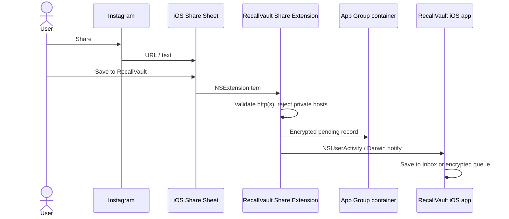

# iOS Share Extension — design now, implement later

RecallVault will appear in the iOS share sheet as **Save to RecallVault**. This document is the contract. Do not implement until the Android MVP is in dogfood.

## Acceptance

- The extension accepts **web URLs and plain text** (`NSExtensionActivationSupportsWebURLWithMaxCount = 1`, `NSExtensionActivationSupportsText = true`).
- It receives only content the user tapped Share on.
- No Instagram cookies, unofficial APIs, scraping, background monitoring, or credentials.
- The extension never auto-opens the URL.

## Architecture

## App Group handoff

- App Group: `group.app.recallvault`
- File: `Library/Application Support/pending-shares.json` inside the group container, encrypted with CryptoKit + Keychain.
- Each record: `uploadId`, canonical URL, identity key, user fields, `provenance: user_shared`.
- The host app observes `CFNotificationCenter` name `app.recallvault.pending-share` and imports on next launch or immediately if running.

## Auth and sync

Same rules as Android:

- Cloud POST `/api/v1/imports/share-target` only with a paired Bearer token in Keychain.
- Otherwise keep the encrypted local queue.
- Idempotency key = `uploadId`.
- Screenshots (Photos picker, user-initiated) stay on device.

## UI

Compact share extension:

1. Show the received URL and detected type (post / reel / story / profile / unknown).
2. Primary: **Save to Inbox**.
3. Optional: title, note, tags, collection, favorite.
4. Success: **Saved to RecallVault** with **Done**.

## Out of MVP

- Universal Links until a production domain exists.
- Bulk `NSExtensionActivationSupportsWebURLWithMaxCount > 1`.
- Fetching Open Graph or any Instagram HTML from the extension.
