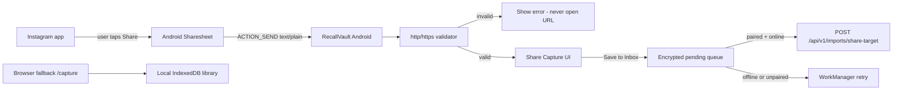

# Share-target architecture

## Provenance

Every share-sheet save is stored with `provenance: "user_shared"`. Instagram is inferred only from hostname/path. The server never crawls the URL.

## Threat model additions

| Threat | Mitigation |
| --- | --- |
| Malicious share text | Strict URL parse, length caps, http(s) only |
| SSRF via share | Private IP/localhost/file/javascript rejected; no server-side fetch |
| Token theft | Android EncryptedSharedPreferences + Keystore |
| Queue theft | EncryptedFile AES-256-GCM |
| Replay | Idempotency-Key = uploadId |
| Log leakage | Audit stores URL hash only |
| Unauthenticated cloud write | 401 + `queueLocally: true` |
